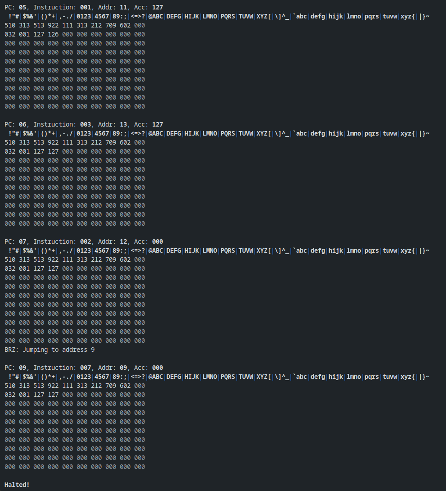

# Rusty-Man Computer

[](https://github.com/RandomSearch18/rusty_man_computer/actions/workflows/build.yml)

This project is an emulator for Little Man Computer (LMC) ([Wikipedia](https://en.wikipedia.org/wiki/Little_man_computer)), written in Rust. Its behaviour is based on [Peter Higginson's online LMC simulator](https://peterhigginson.co.uk/lmc/).

It contains two tools:

- **`rusty_man_computer`** Is the main program. It reads a binary file containing assembled LMC code and runs it.
- **`bin_creator`** is a utility that lets you paste in the contents of LMC's memory (from the online simulator), which it will convert to a binary file (which can be executed by `rusty_man_computer`).

## Screenshots

### Printing every ASCII character

This screenshot only shows the last few clock cycles, after all the characters have been printed.

Each clock cycle, the contents of the registers are shown on the first line, the next line is the output, and then the contents of memory is printed, formatted in the same way as the online simulator (left to right, and then down).



## Usage

### Running the demo programs

#### Addition

Credit: Peter L Higginson, <https://peterhigginson.co.uk/lmc/>

> Output the sum of two numbers

```bash
cargo run --bin rusty_man_computer -- --ram demos/add.bin
```

#### Addition and subtraction

Credit: Peter L Higginson, <https://peterhigginson.co.uk/lmc/>

> Input three numbers.
> Output the sum of the first two
> and the third minus the first

```bash
cargo run --bin rusty_man_computer -- --ram demos/add-subtract.bin
```

#### Basic ASCII characters

Credit: Peter L Higginson, <https://peterhigginson.co.uk/lmc/>

```bash
cargo run --bin rusty_man_computer -- --ram demos/ascii.bin
```

#### Basic ASCII character table

Credit: Peter L Higginson, <https://peterhigginson.co.uk/lmc/>

```bash
cargo run --bin rusty_man_computer -- --ram demos/ascii_table.bin
```

#### Factorial

Credit: 101computing.net, <https://www.101computing.net/LMC/>

Computes the factorial of the given input number. Note that above $6!$, the output will be wrong due to 999 being the highest representable number.

```bash
cargo run --bin rusty_man_computer -- --ram demos/factorial.bin
```

### Running your own programs

At the moment, the easiest way to write a program is using the assembly language in the [online simulator](https://peterhigginson.co.uk/lmc/). Write the assembly code, click "ASSEMBLE INTO RAM", and click-and-drag to copy the contents of the memory text boxes (you can leave out any empty memory at the end).

At the moment, you have to use a text editor to ensure that each memory cell is only separated by a space, and not a line break. (This can also be accomplished by pasting the memory contents into the address bar of your browser, and copying it from there.)

Then you can run `bin_creator`, giving it the file name that the binary file should be written to, e.g.

```bash
cargo run --bin bin_creator -- my_program.bin
```

Then you can run the program as described above, e.g.

```bash
cargo run --bin rusty_man_computer -- --ram my_program.bin
```

### Command-line arguments

- `--ram` specifies a path to a `.bin` file that's used to populate the RAM of the emulator. Essentially, it's the program that you want to run. If you omit this argument, then the emulator will start with empty memory, and not do anything.
- `--output-only` is a flag that disables printing the emulated computer's state every clock cycle. Output is simply printed as it's generated, and input prompts are still displayed.
- `--help` (`-h`) prints the help message, which shows a list of command-line arguments.
- `--version` (`-V`) prints the program name and version.

## Features

Rusty-Man Computer shows the whole state of the computer at the end of every clock cycle, including the contents of the registers, all memory values, the output, and if a branch instruction has been called. This verbose output should make it easy to see what the emulator is doing, and to track your code as it runs.

The emulator aims to be 100% compatible with [the Peter Higginson implementation](https://peterhigginson.co.uk/lmc/help_new.html) (LMC v1.5b, as of February 2025). All instructions and behaviour present in v1.5 have been implemented, so programs should run exactly as they do on the online simulator.
